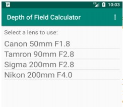
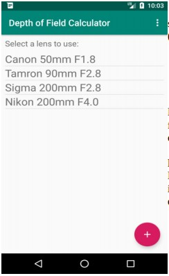
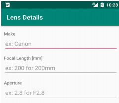
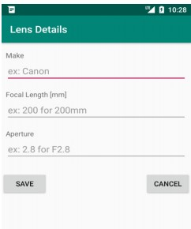
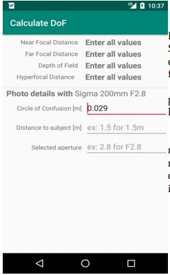
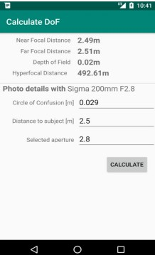
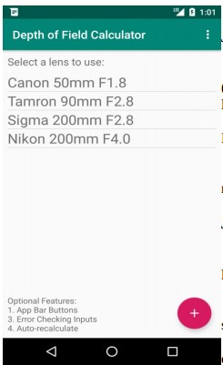
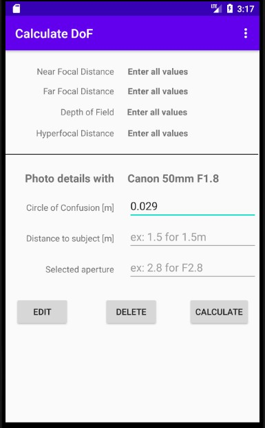

# Camera-Depth-of-Field-Android
Ass on CMPT276 at SFU

### Lens List Activity

- Lenses Display

    - This is the initial activity displayed at startup. Display the lenses from model. For each lens, showed the make, focal length, and maximum aperture. The user may tap on a lens in the list to launch the Calculate Depth of Field activity. When app starts up, show in the screenshot below:

        

- Floating Action Button

    - Use a Floating Action Button (FAB) to allow the user to add a new lens to the collection by launching a new activity to enter lens details. When the app starts up, show in the screenshot below:

        

### Add Lens Activity

- EditText

    - Have entry boxes for the lens's required values. Each EditText have a hint for what goes in it (as shown in the screenshot below). For focal length entry, only allow non-negative integer values. For aperture entry, only allow non-negative floating-point values.

        

- Back / Save Button

    - Have two buttons to accepting or canceling adding the lens. also can replace with Back/Save arrows in the action bar at the top of the screen. 

        

### Calculate Depth of Field Activity

- ViewText & EditText

    - In this page will display the selected lens's description. 
    - Allow users to enter Caamera's circle of confusion, distance to subject(in meters) and selected aperture(the F number).
    - Allow only non-negative decimal value
    - Pre-populate the circle of confusion with 0.029
    
        

- Calculate Button

    - Use button to calculate and dispaly the four depth of field value
    
        

### Make Improvements to the App

- App Bar Buttons Via Toolbar

    - Use the Toolbar widget to give all activities an app bar (also called the action bar) at the top of the activities to give at least the following buttons:
      - Add Lens activity and Edit have Back and Save.
      - Calculate activity have Back.
        
        

- Edit and Delete Lens

    - There have one more page support editing and removing a lens stored in the list of lenses.
        

- Error Check Input 
    - // todo

- Auto-recalculate
    - // todo

- Lens Icons
    - // todo

- Empty State
    - // todo
